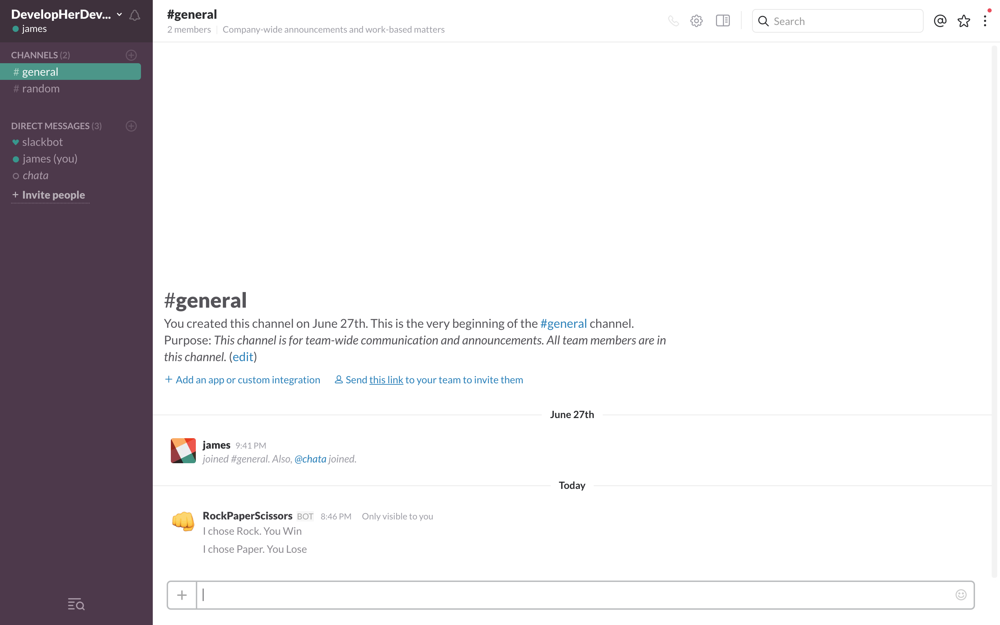

Getting Started On Slack's Slash Command API - Making a Rock, Paper, Scissor Game
---------------------------------------------------------------------------------

**Description**

A Rock, Paper, Scissor game that you can connect to your [Slack](https://slack.com/) Channel. 

**How it works**

Rock, Paper, Scissor's game was coded in python and uses [NodeJS/NPM](https://www.npmjs.com/package/localtunnel) and [Webapp2](https://webapp-improved.appspot.com/). When the script is run, the server can receive POST request from [Slack](https://slack.com/). 

Step-by-step guide provided by [DevelopHerDevelopHim](https://www.youtube.com/channel/UCmAIHsNUyAzJ6FQMdU5jdRw) on their episode [Getting Started On Slack's Slash Command API - Making a Rock, Paper, Scissor's Game](https://youtu.be/HpSIlZGQ_Mo)

### Screenshot

**Playing in your Slack Channel**

### About the Developers    

James Cha    
[Linkedin](https://www.linkedin.com/in/jamesjcha)         

Jessica Dene Earley    
[Short Bio](https://chatasweetie.com/about-me/)   
[Linkedin](https://www.linkedin.com/in/jessicaearley)      
[Jessica's Blog](https://chatasweetie.wordpress.com/)  